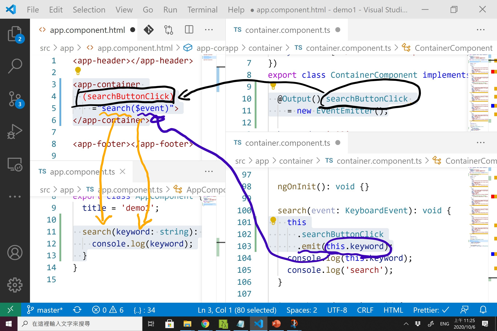

# 補充內容

- [TSLint 規則](https://palantir.github.io/tslint/rules/)
- [Codelyzer 規則 (for Angular 用的)](https://github.com/mgechev/codelyzer)
- [Windows 小技巧: 繁體中文語言如何變更預設輸入法(英文)](https://blog.miniasp.com/post/2012/06/30/Windows-8-Tips-How-to-change-default-input-method-for-languages)

## 熱鍵表

- 下載 PDF 檔
    - [Windows](https://code.visualstudio.com/shortcuts/keyboard-shortcuts-windows.pdf)
    - [Mac](https://code.visualstudio.com/shortcuts/keyboard-shortcuts-macos.pdf)
    - [Linux](https://code.visualstudio.com/shortcuts/keyboard-shortcuts-linux.pdf)

- 全部儲存：
    - [Win] ctrl + k, s
    - [Mac] cmd + option + s

- 切換關聯檔案
    - [Win] alt + o / i / u / p
    - [Mac] option + shift + o / i / u / p
    - o: html
    - i: css
    - u: ts
    - p: spec.ts

- 快速開啟檔案
    - [Win] ctrl + p
    - [Mac] cmd + p

- 開啟/關閉左邊的 siderbar
    - [Win] ctrl + b
    - [Mac] cmd + b

- 開啟/關閉檔案總管
    - [Win] ctrl + shift + e
    - [Mac] cmd + shift + e

- 開啟/關閉搜尋視窗
    - [Win] ctrl + shift + f
    - [Mac] cmd + shift + f

- 開啟/關閉原始檔控制(git)
    - [Win/Mac] ctrl + shift + g

- 自動排版
    - [Win/Mac] alt + shift + f (記得設定 prettier.singleQuote)

- 註解/取消註解
    - [Win] ctrl + /
    - [Mac] cmd + /

## Emmet

- https://emmet.io/

## Prettier 設定檔

- 建立 `.prettierrc`
- 設定內容: https://prettier.io/docs/en/options.html

## Output 資料流程

https://www.facebook.com/photo?fbid=10219059938679688&set=gm.2472608106082878

## Input 資料流程

https://www.facebook.com/photo?fbid=10219059941079748&set=gm.2472608106082878

## ngIf

https://www.facebook.com/photo?fbid=10219059943559810&set=gm.2472608106082878

## ngFor

https://www.facebook.com/photo?fbid=10219059945319854&set=gm.2472608106082878

## Debug

- 安裝 Debugger for Chrome Extension
- F1 -> >Debug: Start Debugging and Stop on Entry
- 產生 .vscode/launch.json

## 元件庫

- [Angular Material](https://material.angular.io/)
- [PrimeNG](https://www.primefaces.org/primeng/showcase/#/)
- [NG-ZORRO](https://ng.ant.design/docs/introduce/en)
- [NG Bootstrap](https://ng-bootstrap.github.io/#/home)
- [SB Admin Angular](https://startbootstrap.com/templates/sb-admin-angular/)

- [Angular Material 完全攻略](https://wellwind.idv.tw/blog/categories/Angular-Material%E5%AE%8C%E5%85%A8%E6%94%BB%E7%95%A5/)
  - 文章版本比較舊，參考就好

## RxJS

- [RxJS](https://rxjs-dev.firebaseapp.com/)
- [打通 RxJS 任督二脈](https://wellwind.idv.tw/blog/categories/%E6%89%93%E9%80%9A-RxJS-%E4%BB%BB%E7%9D%A3%E4%BA%8C%E8%84%88/)
- [[Angular 大師之路] 在 Angular 中應用 RxJS 的 operators (1) - 基礎篇](https://wellwind.idv.tw/blog/2018/11/13/mastering-angular-29-angular-with-rxjs-basic/)
- [[Angular 大師之路] 在 Angular 中應用 RxJS 的 operators (2) - 進階應用](https://wellwind.idv.tw/blog/2018/11/14/mastering-angular-30-angular-with-rxjs-advanced/)

## 問題排除

- F12 看到 `Error: Angular JIT compilation failed: '@angular/compiler' not loaded!` 
  - 重開 VSCode
- PowerShell 簽章問題
  1. F1
  2. Terminal: Select Default Shell
  3. Command Prompt
